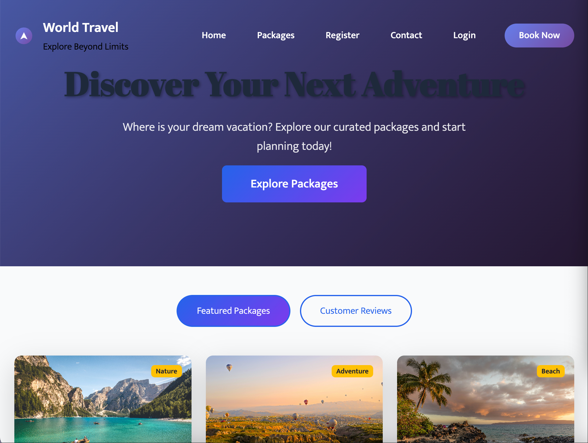

# Thread Project Next

## 📖 Overview

**Thread Project Next** is a modern, responsive travel booking portal that enables users to discover and book dream vacations with ease. Built with cutting-edge web technologies, this application provides an intuitive interface for browsing curated travel packages, managing bookings, and planning unforgettable journeys.

## 🌐 Live Demo

Visit the live application: [https://thread-project-next.onrender.com](https://thread-project-next.onrender.com)

## ✨ Features

### 🎯 **Interactive Home Experience**

- Engaging hero section with "Where is your dream vacation?" call-to-action
- Curated travel package showcases
- Featured packages and customer reviews sections
- Clean, modern design with clear visual hierarchy

### 📦 **Smart Package Exploration**

- Organized display of vacation packages
- Easy access to package details and booking options
- Visually appealing package cards with essential information
- Quick "Explore Packages" navigation

### 👤 **User-Centric Interface**

- Intuitive navigation and clear information architecture
- Visual feedback on interactive elements
- Organized content presentation
- Emphasis on user experience and engagement

## 🛠️ Technology Stack

### **Frontend**

- Next.js - React framework for server-side rendering and static generation
- React - Component-based UI library
- Modern CSS - Responsive styling with Flexbox/Grid
- JavaScript (ES6+) - Interactive functionality

### **Deployment & Hosting**

- Render.com - Cloud platform for deployment
- Automated Builds - Continuous integration and deployment
- SSL/TLS - Secure HTTPS connections

## 📱 Key Pages

1. **Home Page** - Welcome and introduction to travel services
2. **Vacation Packages** - Browse all available travel packages
3. **Customer Registration** - User account creation
4. **Contact Us** - Get in touch with customer support
5. **Login** - Secure authentication portal

## 🎨 **Design Highlights**

**Visual Elements**

- Clean, travel-themed aesthetic
- High-quality imagery and visual hierarchy
- Clear typography and readable content
- Balanced color scheme promoting trust and excitement

**User Experience**

- Minimal clicks to find desired information
- Clear calls-to-action throughout
- Organized content sections
- Seamless navigation flow

## 📄 **Page Structure**

**Hero Section**

- Compelling headline: "Where is your dream vacation?"
- Engaging introduction
- Primary call-to-action button

**Featured Packages**

- Curated selection of top vacation packages
- Visual package cards with key details
- Easy booking initiation

**Customer Reviews**

- Social proof section
- Testimonials from satisfied travelers
- Trust-building content

## 🚀 **Performance Features**

- Server-Side Rendering for fast initial page loads
- Optimized Images for quick rendering
- Code Splitting for efficient resource loading
- Minified Assets for production performance
- Responsive Images for bandwidth optimization

## 🔒 **Security & Reliability**

- HTTPS Enforcement for all connections
- Secure Hosting on Render platform
- Regular Updates and maintenance
- DDoS Protection through hosting provider

## 🎯 **Project Objectives**

This project demonstrates:

- Modern React/Next.js development practices
- Responsive web design principles
- User-centered interface design
- Cloud deployment and hosting
- Performance optimization techniques

## 📈 **Future Enhancements**

Planned upgrades and features:

- User Authentication System for personalized experiences
- Advanced Search & Filtering for packages
- Booking Management System
- Mobile Application development

## 👥 **Target Users**

- Travel Enthusiasts seeking vacation inspiration
- Individual Travelers planning personal trips
- Families organizing group vacations
- Travel Researchers comparing package options
- Web Development Students learning modern frameworks

## 🔧 **Development Setup**

- Prerequisites
- Node.js 16+ and npm/yarn
- Git for version control
- Code editor (VS Code recommended)
